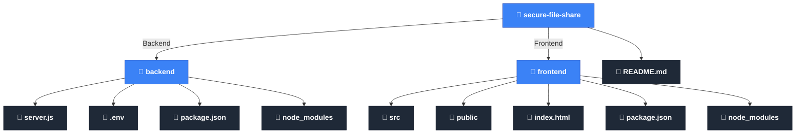

# secure-file-share

> Hang on … 😪

# Structure

```mermaid
graph TD;
    A[📂 secure-file-share] -->|Backend| B[📁 backend]
    B --> B1[📄 server.js]
    B --> B2[📄 .env]
    B --> B3[📄 package.json]
    B --> B4[📂 node_modules]

    A -->|Frontend| C[📁 frontend]
    C --> C1[📂 src]
    C --> C2[📂 public]
    C --> C3[📄 index.html]
    C --> C4[📄 package.json]
    C --> C5[📂 node_modules]

    A --> D[📄 README.md]

    %% Styling for better visualization
    classDef folder fill:#3b82f6,stroke:#1e40af,color:#fff,font-weight:bold;
    classDef file fill:#1f2937,stroke:#111827,color:#fff,font-weight:bold;
    
    class A folder;
    class B,C folder;
    class B1,B2,B3,B4,C1,C2,C3,C4,C5,D file;

```