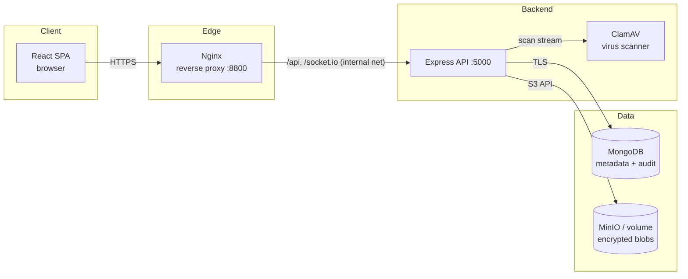
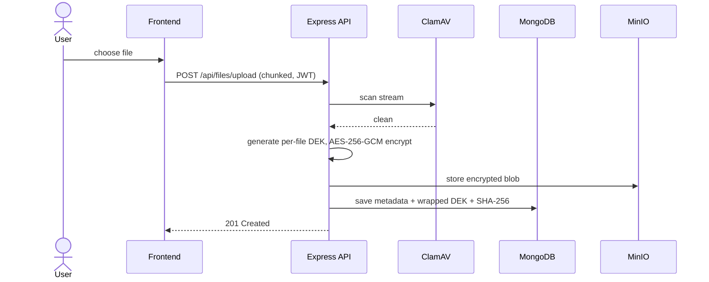
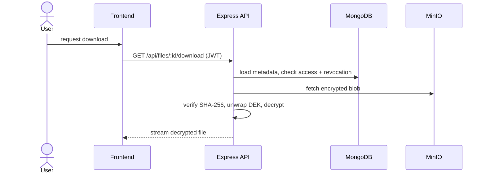
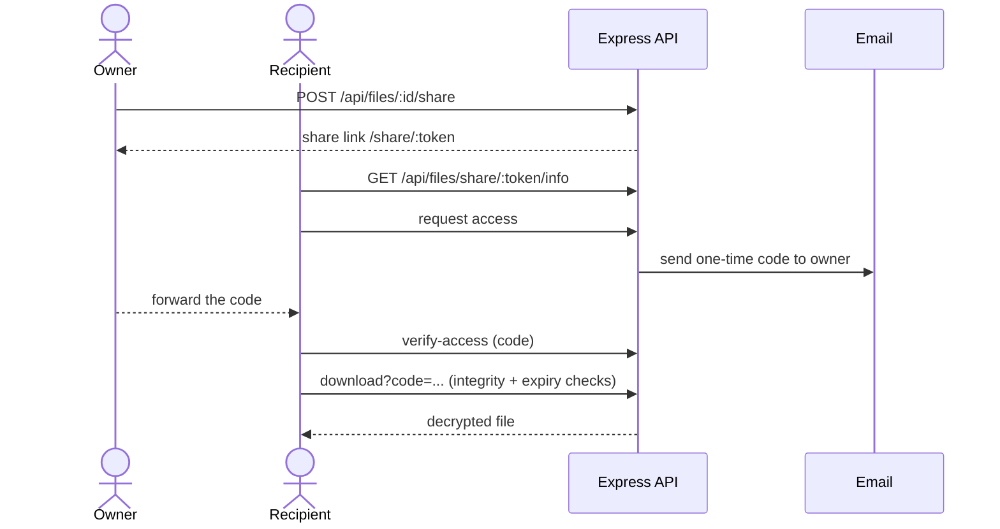
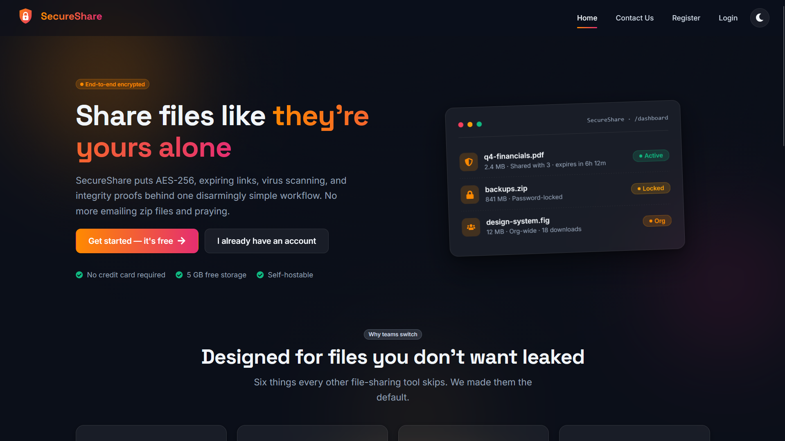
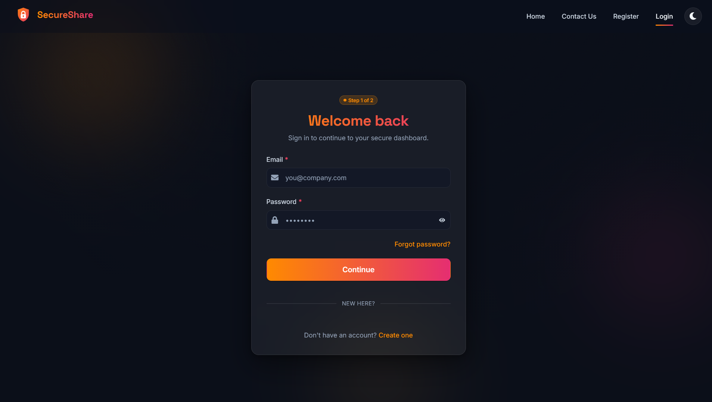
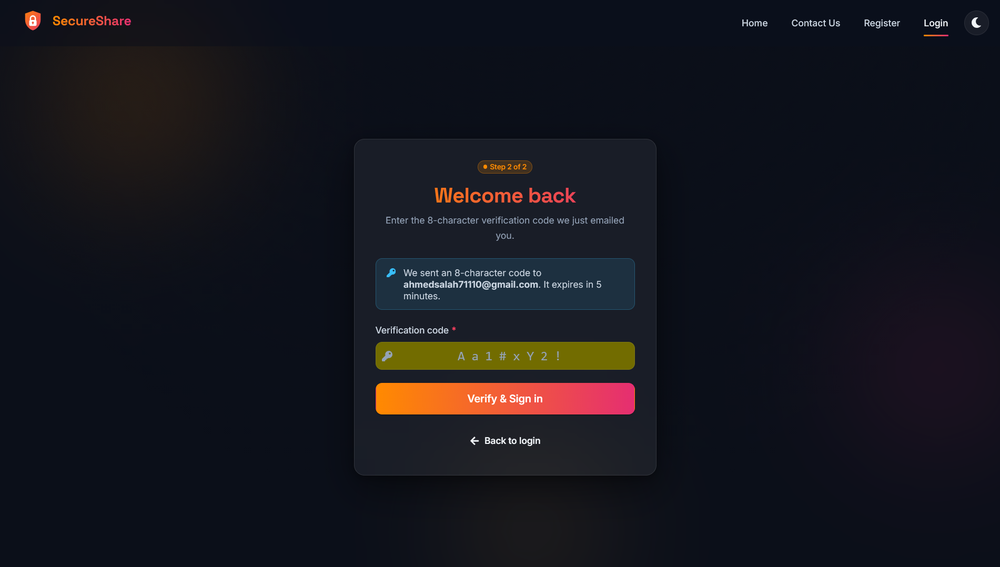
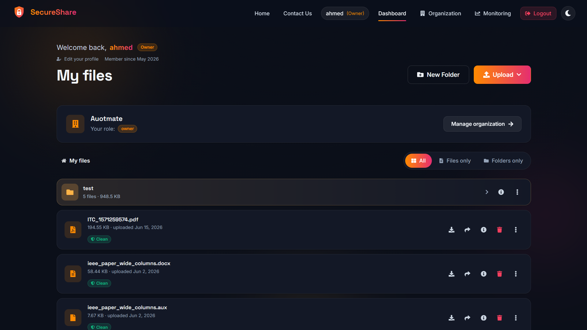

# Advanced Encrypted File Sharing and Organizational Access Control

  

> Encrypted file storage and sharing with organization-aware access control.

`secure-file-share` is a self-hostable platform for storing and sharing files that shouldn't leak. Most teams fall back to email attachments or public links with no expiry, no access control, and no record of who opened what. This system encrypts every file with its own key before it touches storage, scans uploads for malware, and gates sharing behind owner-approved one-time codes. Organizations get role-based access (owner, manager, staff) and a tamper-evident audit trail of every action. It runs as a small Docker stack: React frontend behind Nginx, an Express API, MongoDB, and MinIO for encrypted blob storage.

## Architecture


```mermaid
flowchart LR
    subgraph Client
        B[React SPA<br/>browser]
    end

    subgraph Edge
        N[Nginx<br/>reverse proxy :8800]
    end

    subgraph Backend
        E[Express API :5000]
        CV[ClamAV<br/>virus scanner]
    end

    subgraph Data
        M[(MongoDB<br/>metadata + audit)]
        S[(MinIO / volume<br/>encrypted blobs)]
    end

    B -- HTTPS --> N
    N -- "/api, /socket.io (internal net)" --> E
    E -- scan stream --> CV
    E -- "TLS" --> M
    E -- "S3 API" --> S
```

The browser only ever talks to Nginx. Nginx serves the static frontend and proxies `/api` and the Socket.IO realtime feed to the Express backend over the internal Docker network — the API port is never exposed publicly. The backend encrypts blobs before writing them to MinIO (or a mounted volume), keeps file metadata, wrapped keys, and the audit chain in MongoDB, and streams uploads through ClamAV.

## File Flow

**Upload** — scan, then encrypt, then store.


```mermaid
sequenceDiagram
    actor U as User
    participant F as Frontend
    participant API as Express API
    participant AV as ClamAV
    participant DB as MongoDB
    participant ST as MinIO

    U->>F: choose file
    F->>API: POST /api/files/upload (chunked, JWT)
    API->>AV: scan stream
    AV-->>API: clean
    API->>API: generate per-file DEK, AES-256-GCM encrypt
    API->>ST: store encrypted blob
    API->>DB: save metadata + wrapped DEK + SHA-256
    API-->>F: 201 Created
```

**Download** — verify access and integrity, then decrypt.


```mermaid
sequenceDiagram
    actor U as User
    participant F as Frontend
    participant API as Express API
    participant DB as MongoDB
    participant ST as MinIO

    U->>F: request download
    F->>API: GET /api/files/:id/download (JWT)
    API->>DB: load metadata, check access + revocation
    API->>ST: fetch encrypted blob
    API->>API: verify SHA-256, unwrap DEK, decrypt
    API-->>F: stream decrypted file
```

**Sharing** — owner-approved, one-time code.


```mermaid
sequenceDiagram
    actor O as Owner
    actor R as Recipient
    participant API as Express API
    participant MAIL as Email

    O->>API: POST /api/files/:id/share
    API-->>O: share link /share/:token
    R->>API: GET /api/files/share/:token/info
    R->>API: request access
    API->>MAIL: send one-time code to owner
    O-->>R: forward the code
    R->>API: verify-access (code)
    R->>API: download?code=... (integrity + expiry checks)
    API-->>R: decrypted file
```

## Screenshots

**Home** — landing page.



**Login** — two-step sign in: email and password, then an emailed one-time code (MFA).

| | |
|---|---|
|  |  |
| Step 1 — credentials | Step 2 — verification code |

**Dashboard** — files, folders, and organization access.



## Features

**Security.** Every file is encrypted at rest with AES-256-GCM using a unique per-file data key, which is itself wrapped by a versioned master key (envelope encryption) so keys can be rotated without re-encrypting blobs. Passwords are hashed with Argon2id. Auth uses short-lived JWT access tokens with rotating refresh tokens and reuse detection. A hash-chained audit log records every action and can be cryptographically verified for tampering.

**File management.** Drag-and-drop chunked uploads with progress, per-file locking, expiry dates with automatic cleanup, and SHA-256 integrity verification on every download. Uploads are scanned with ClamAV before they're stored.

**Sharing.** Share links never expose a file directly. The recipient requests access, the owner receives a one-time code by email, and the file only unlocks after the code is verified — with expiry, revocation, and download limits enforced on every attempt.

**Organizations.** Teams join through an invite key and are scoped by role (owner, manager, staff), with server-enforced permissions regardless of what the client sends. Managers get a live monitoring dashboard backed by a Socket.IO feed; admins get user/file management and the security event stream.

## Tech Stack

- **Frontend:** React 19, Vite, React Router, Framer Motion, Socket.IO client
- **Backend:** Node.js, Express, MongoDB/Mongoose, MinIO, Argon2id, JWT, Zod, ClamAV
- **DevOps:** Docker Compose, Nginx, MinIO

## Quick Start

Requires Docker. From the project root:

```bash
git clone <repo-url> secure-file-share && cd secure-file-share
cp .env.example .env   # set MONGO_URI, JWT_SECRET, ENCRYPTION_KEY, SMTP_*
docker compose up --build -d
```

The app is served at `http://localhost:8800`. MinIO's console is at `http://localhost:9001`.

## Project Structure

```
secure-file-share/
├── backend/            # Express API
│   ├── middleware/     # auth, rate limit, validation, logging
│   ├── models/         # Mongoose schemas (User, File, AuditLog, ...)
│   ├── routes/         # auth, files, folders, organization, admin, user
│   ├── scripts/        # key + encryption rotation
│   ├── utils/          # crypto, storage, key vault, audit, observability
│   └── server.js
├── frontend/           # React + Vite SPA
│   ├── src/            # pages, components, hooks, auth, theme, api.js
│   └── vite.config.js
├── nginx/conf/         # reverse proxy config
├── docs/screenshots/   # README images
├── docker-compose.yml
└── Dockerfile
```

## License

Developed for academic and educational purposes.
