# 🚀 **Secure File Sharing Application - Project Report**  

## 🎯 **1. Project Overview**  

The **Secure File Sharing Application** ensures **safe, encrypted, and private file transfers** between users.  
By integrating advanced **security protocols**, this project protects sensitive data from unauthorized access, ensuring **data integrity and confidentiality**.  

### 🔐 **Key Security Features:**  
✅ **End-to-End Encryption** – Protects files from interception.  
✅ **Password-Protected Downloads** – Adds an extra layer of security.  
✅ **Secure Authentication** – Uses **JWT (JSON Web Tokens)** for user sessions.  
✅ **Access Control** – Ensures only authorized users can download or modify files.  
✅ **Data Integrity Checks** – Prevents file tampering during transfer.  

---

## 🛠 **2. Tech Stack & Tools Used**  

### 📌 **Frontend (Client-Side):**  
- 🎨 **React.js** – Provides an interactive and responsive UI.  
- ⚡ **Vite** – Ensures a fast development experience.  
- 🎭 **Bootstrap** – Enhances styling and responsiveness.  

### 📌 **Backend (Server-Side):**  
- 🏗 **Express.js** – A lightweight web framework for building APIs.  
- 🗄 **MongoDB** – A NoSQL database for storing user data & file metadata.  
- 📜 **Mongoose** – Simplifies interactions with MongoDB.  
- 🌍 **CORS** – Allows secure cross-origin requests.  
- 🛠 **dotenv** – Manages sensitive environment variables securely.  

---

## 📂 **3. Project Architecture & Security Features**  

### 🏗 **Architecture Overview**  


1️⃣ User interacts with the frontend (React UI).
2️⃣ Frontend makes API requests to the backend (Express).
3️⃣ Backend processes authentication, file storage, and encryption.
4️⃣ MongoDB stores file metadata, user details, and access permissions.
5️⃣ Users can securely download files using unique links & authentication.


## 📌 4. Frontend Workflow (React + Vite + Bootstrap)
🔹 User Registration & Login
✔️ User signs up → frontend sends credentials to the backend.
✔️ Backend hashes passwords before storing them in MongoDB.
✔️ Upon successful login, backend issues a JWT (JSON Web Token) → stored in `localStorage` for authentication.


💻 Example Flow:


<hr style="width: 50%; margin: auto;">


### 🔹 Secure File Upload
✔️ User selects a file & uploads it via a form.
✔️ Frontend sends the file along with the JWT token for authentication.
✔️ Backend encrypts the file before storing it on the server.
✔️ MongoDB stores metadata (filename, encryption key, owner info).


💻 How it Works (Step by Step):


<hr style="width: 50%; margin: auto;">


### 🔹 Secure File Sharing & Download
✔️ Backend generates a unique, temporary link for the uploaded file.
✔️ Users can share the secure link with others.
✔️ When a user accesses the link, backend checks authentication & permissions.
✔️ If valid, backend decrypts the file before sending it for download.

💻 Download Flow:

```mermaid
sequenceDiagram
    participant User
    participant Frontend
    participant Backend
    participant Storage
    participant Database

    User->>Frontend: Clicks download link
    Frontend->>Backend: Sends request (GET /api/download/:fileID) with JWT
    Backend->>Database: Check permissions & authentication
    Backend->>Storage: Decrypt and fetch file
    Storage-->>Backend: Send decrypted file
    Backend-->>Frontend: File download response
    Frontend-->>User: File downloaded securely

```


---


## 🔒 5. Backend Security & Encryption
📌 Authentication & JWT Security
✔️ JWT (JSON Web Token) is issued upon login.
✔️ Stored in HTTP-only cookies for security.
✔️ Middleware checks the token before allowing access to secure routes.

💻 Example Middleware (Express.js)
```js
const jwt = require("jsonwebtoken");

function authenticateToken(req, res, next) {
    const token = req.headers["authorization"];
    if (!token) return res.status(403).json({ error: "Access denied" });

    jwt.verify(token, process.env.JWT_SECRET, (err, user) => {
        if (err) return res.status(401).json({ error: "Invalid token" });
        req.user = user;
        next();
    });
}

```

<hr style="width: 50%; margin: auto;">


📌 File Encryption & Storage
✔️ Uses AES-256 encryption before saving files.
✔️ Encrypted keys stored separately from file data.
✔️ MongoDB stores metadata, but not actual file content.

💻 Encryption Example (Node.js - Crypto Module)
```js
const crypto = require("crypto");
const fs = require("fs");

const encryptFile = (filePath, secretKey) => {
    const cipher = crypto.createCipher("aes-256-cbc", secretKey);
    const input = fs.createReadStream(filePath);
    const output = fs.createWriteStream(filePath + ".enc");

    input.pipe(cipher).pipe(output);
};

encryptFile("uploads/file.pdf", "secureKey123");

```

---

⚙️ 6. Environment Configuration & Deployment
📌 Environment Variables (`.env`)
All sensitive configurations are stored securely in the `.env` file:

```ini
MONGO_URI=mongodb://your-database-url
JWT_SECRET=your-secure-jwt-secret
PORT=5000

```


---

## 🚀 7. Final Thoughts & Future Enhancements
### ✔️ Project Highlights
- Secure File Encryption → Prevents unauthorized access.
- JWT-Based Authentication → Strong user session management.
- MongoDB for Scalable Storage → Flexible & fast data management.
- Temporary Secure Links → Control file-sharing permissions.

### 🔮 Future Enhancements
- Multi-Factor Authentication (MFA) for added security.
- Blockchain Integration for tamper-proof file logs.
- Automatic Virus Scanning for uploaded files.

---

## 🚀 Next Steps:

 > Implement real-time notifications & AI-powered threat detection!
 
---
 


